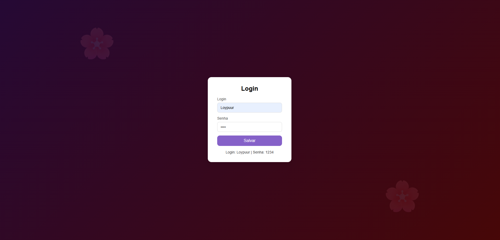

# 🖥️ Tela de Login | Login Screen

---

Uma interface simples e funcional de **login**, desenvolvida para praticar **HTML, CSS e JavaScript**.  
O projeto apresenta **design responsivo**, **validação básica de campos** e **estrutura organizada**.

A simple and functional **login screen** built to practice **HTML, CSS, and JavaScript**.  
The project features a **responsive design**, **basic field validation**, and **clean structure**.

---

## 🚀 Demonstração | Demo

---

## 🛠️ Tecnologias utilizadas | Technologies Used

- **HTML5**  
- **CSS3**  
- **JavaScript (Vanilla)**

## 🧑‍💻 Autor | Author

Feito com por Gabriely Barreto

Made with by Gabriely Barreto

## 📄 Licença | License

Este projeto está sob a licença MIT — veja o arquivo LICENSE
 para mais detalhes.
 
This project is under the MIT license — see the LICENSE
 file for more details.
